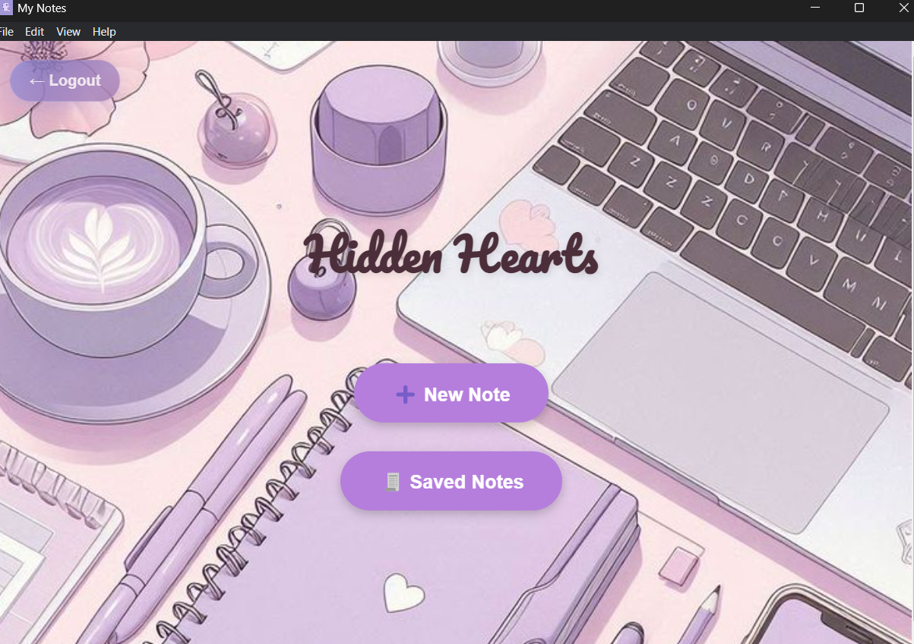
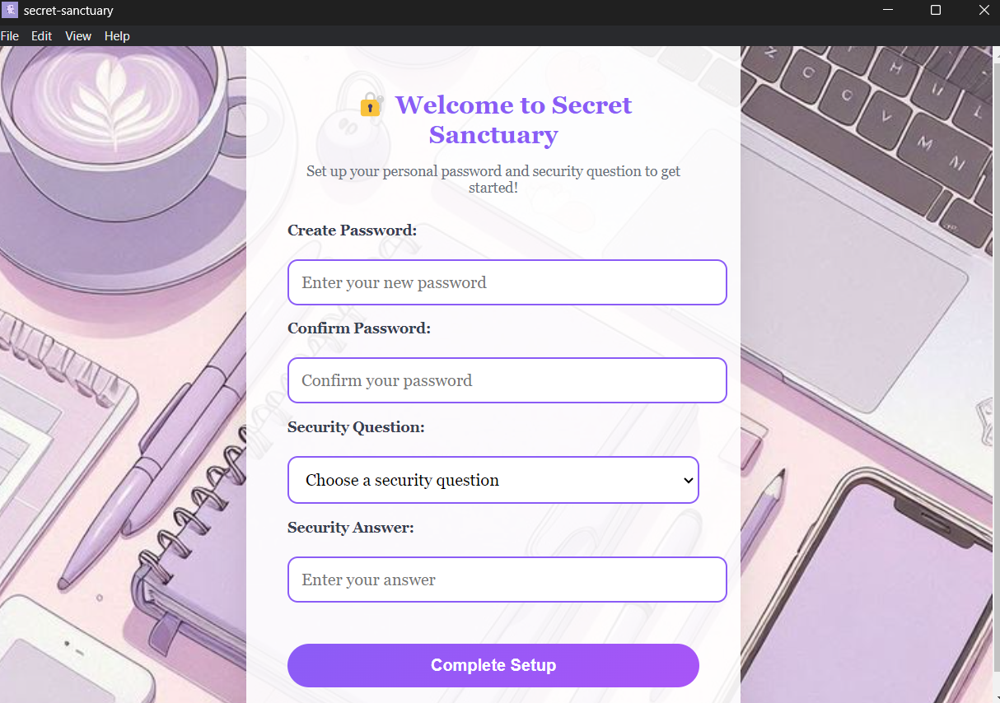
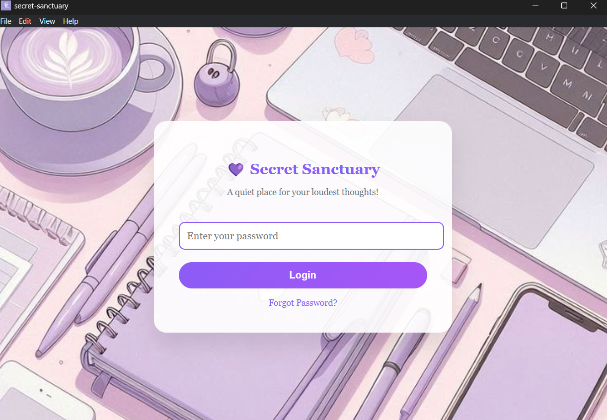
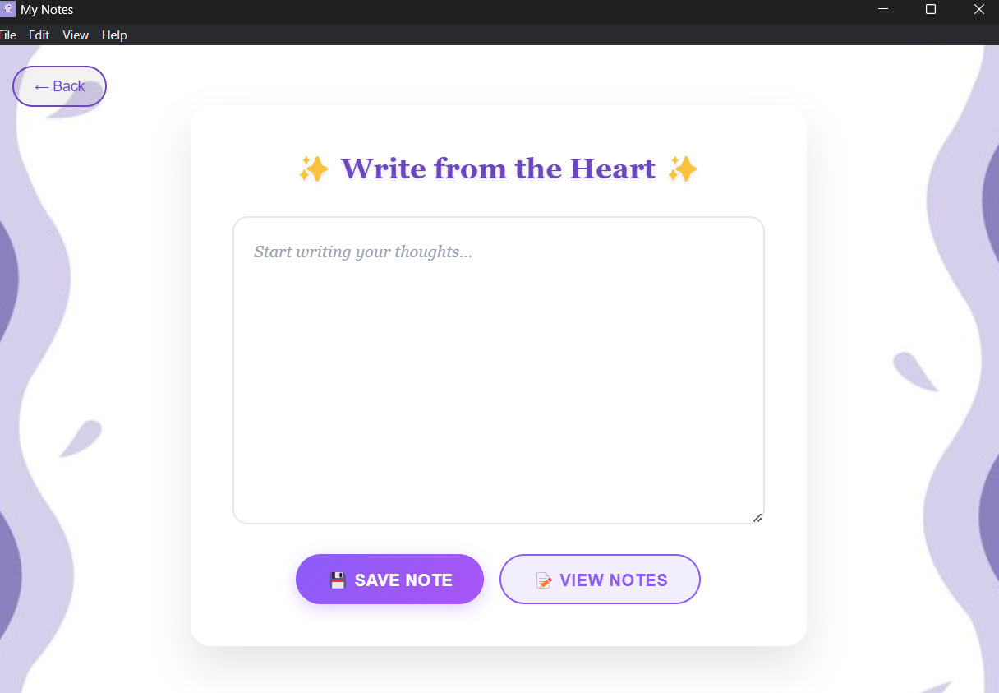
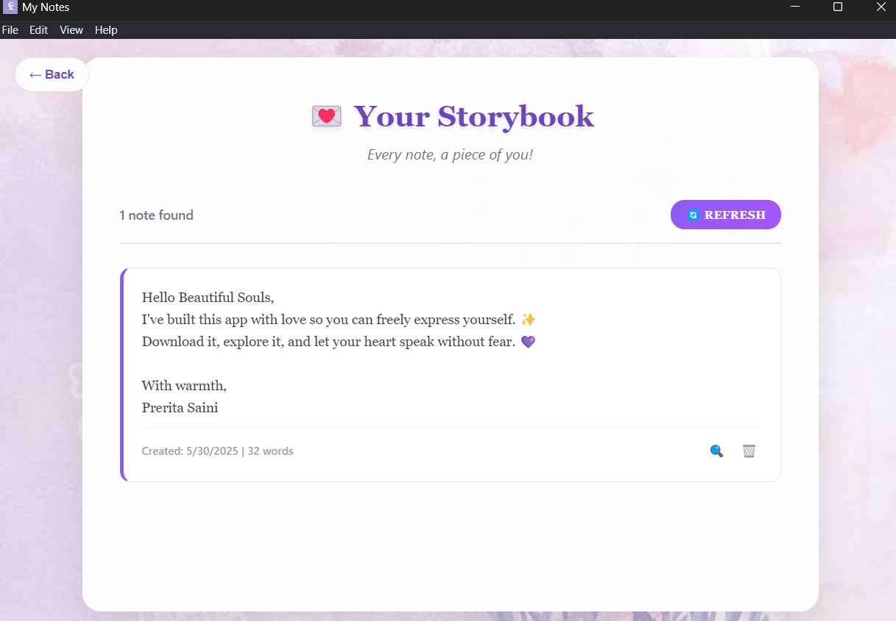
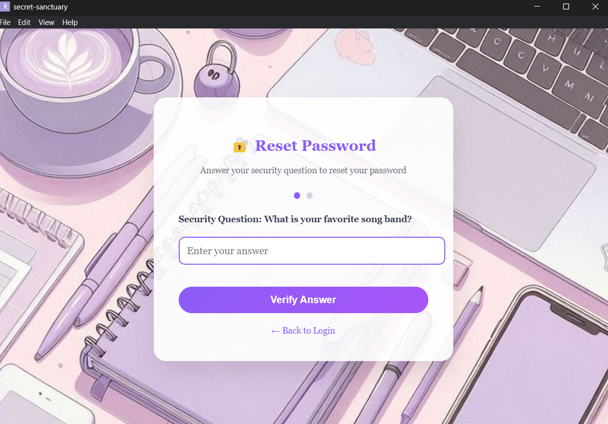
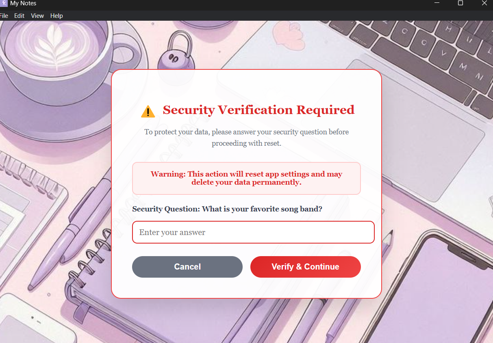
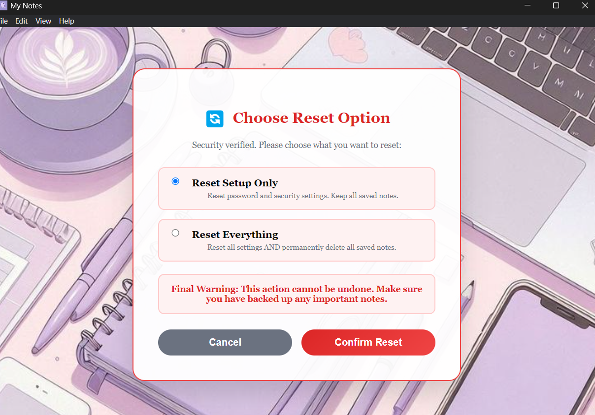

# 💜 Secret Sanctuary – A Beautiful Note-Taking App

**Secret Sanctuary** is a secure and elegant note-taking desktop app built with **Electron.js**. It's designed to give your loudest thoughts a quiet place to live.

 <!-- Replace this with an image from your repo or local path -->

---

## ✨ Features

- 🔐 Password-protected login
- 🧠 Security question-based password recovery
- ✏️ Write beautiful notes with a calm UI
- 💾 Save notes with word count and timestamps
- 📜 View all your notes, expand or delete them
- 🛡️ Unsaved changes warnings
- 🖼️ Gorgeous UI with custom backgrounds
- 🖥️ Windows executable file included

---

## 🚀 Download the App

👉 [Click here to download the latest version (.exe)](https://github.com/preritasaini1/Secret_Sanctuary_App-electron.js/releases/tag/v1.0.0)

---

## 🎬 Demo
[](https://drive.google.com/file/d/YOUR_VIDEO_ID/view?usp=sharing)

---

## 📷 Application Preview

### Setup & Security

*Setup password and security question*

### Login 

*Secure password-protected entry point*

### Note Creation

*Clean, distraction-free writing environment*

### Note Management

*Organized view of all your saved thoughts*

### Reset Password & App



*Secure Reset Password and App Functinality*

---

## 🔧 How to Run Locally

```bash
git clone https://github.com/preritasaini1/Secret_Sanctuary-electron.js_app.git
cd Secret_Sanctuary-electron.js_app
npm install
npm start
```

---

## 🏗️ Build Your Own `.exe`

```bash
npm run build
```

> This will use Electron Builder to package your app into a Windows executable inside the `dist/` folder.

---

## 📁 Project Structure

```
.
├── main.js
├── login.html
├── index.html
├── new_note.html
├── saved_notes.html
├── forgot_password.html
├── assets/
├── dist/            # Built .exe lives here
├── build.js         # Build script
├── package.json
└── electron-builder.config.js
```

## 🔧 Technical Stack

- **Framework:** [Electron.js](https://electronjs.org/)
- **Frontend:** HTML5, CSS3, Vanilla JavaScript
- **Build Tool:** [Electron Builder](https://electron.build/)
- **Package Manager:** npm

---

## 👩‍💻 Created With Love

Made by **Prerita Saini** - [GitHub](https://github.com/preritasaini1)💜  
_"Live your life the way you want, do what makes you happy."_ ☁️

---

## 📜 License
This project is licensed under the MIT License - see the LICENSE file for details.

---

**⭐ Star this repo if you found it helpful!**

*Secret Sanctuary - Where your thoughts find their home*
*Made with 💜*
